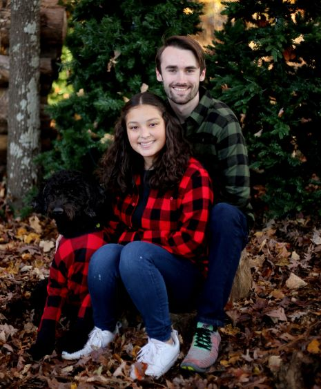

  Hey there! This is my personal website! If you spot any errors or have any suggestions for future projects I should pursue, please let me know! Feel free to email me at daniel@dagleaves.com for any suggestions or inquiries. Thanks!

This is the personal blog of Daniel Gleaves (me!). I am currently a third-year computer science student at the University of South Carolina in Columbia, SC. I am interested in artificial intelligence and have completed 2 years of research with the Machine Learning and Evolution Laboratory at UofSC focusing on convolutional graph neural networks for material discovery. I am now working on continous learning neural networks and instance-aware image translation with spatial transformations.

Outside of academics, I enjoy learning Chinese, fishkeeping, reading, programming, fishing, weightlifting, and more!

## Setup

If you are interested in setting up a similar website of your own, you can find my write-up [here](https://dagleaves.github.io/2022/01/11/setup-website)! 

The setup of the website is as follows:

- Built using [Jekyll](https://jekyllrb.com)
- Hosted for free on [GitHub Pages](https://pages.github.com)
- Uses the [Dark Poole](https://github.com/andrewhwanpark/dark-poole) theme

Thanks for reading!
